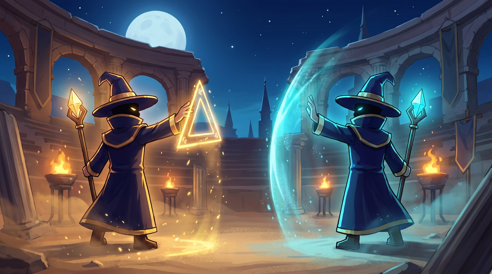

# RUNESPIRE



> **A first-person magic duel in the browser.** Your webcam tracks the pen in your hand.
> Hold `Shift`, **draw a rune in the air**, and the spell fires. Step aside to dodge —
> the fireball is coming at your face.

Every motion-controlled game competes on how *big* you can move.
This one competes on how *precisely* you can draw.

Built at a 36-hour hackathon. 5 people. TypeScript + Vite + Three.js + MediaPipe.

---

## The game

Two duellists face each other across an arena. You see it in first person — there is no
avatar of you on screen, only your opponent.

| Input | Action |
|---|---|
| `A` / `D` | Step left and right to dodge |
| `Shift` + draw **△** | **Attack** — a bolt flies at your opponent |
| `Shift` + draw **□** | **Build** — raises cover in front of you |

A projectile locks its target at the moment it is fired and never tracks you afterwards.
That is what makes it dodgeable: see the wind-up, read the lane, step out of it.

**Three rules govern cover** — they are what make building worth the mana:

1. An enemy attack that hits your cover costs the wall one of its 2 hit points. You take nothing.
2. Your own attacks pass **through** your own cover. Building defends *and* lets you keep firing.
3. While an opponent stands behind cover you cannot read their HP/MP — the nameplate shows `???`.

Match is 90 seconds. 10 HP, 2 damage per hit. 100 MP, regenerating: attack costs 25, cover costs 45.

---

## Requirements

- **Node.js 20+** (developed on 24)
- A **webcam** and a pen, chopstick, or any slim object to draw with
- **HTTPS** — browsers only grant camera access over a secure origin. The dev server
  handles this with `vite-plugin-mkcert`; the first run asks for your password to install
  a local certificate authority.
- Chrome or Edge recommended (MediaPipe's GPU delegate is most reliable there)

Mouse mode works without a webcam, so you can develop and test everything except the tracking itself.

---

## Setup

```bash
git clone https://github.com/Ivan53040/Hackathon_2026.git
cd Hackathon_2026
npm install
```

### Fetch the MediaPipe assets

The hand-tracking runtime and model are **not committed** (they are ~30 MB and are in
`.gitignore`). Fetch them once after `npm install`:

```bash
cp node_modules/@mediapipe/tasks-vision/wasm/* public/mediapipe/
```

```bash
curl -L -o public/mediapipe/hand_landmarker.task https://storage.googleapis.com/mediapipe-models/hand_landmarker/hand_landmarker/float16/1/hand_landmarker.task
```

Serving them from `public/` instead of a CDN is deliberate: the venue's wifi cannot be
trusted, and the demo has to run offline.

---

## Run

```bash
npm run dev
```

Open **https://localhost:5173**. Accept the certificate warning if your browser shows one.

That is enough for single-player. For online rooms, start the backend in a second terminal:

```bash
npm run server
```

It listens on `:8787`.

### Straight into a match

Skip the menu and drop into a duel against the bot:

```
https://localhost:5173/?solo=1
```

### Hotkeys

| Key | |
|---|---|
| `1` | Switch tracking to the webcam (MediaPipe) |
| `2` or `M` | Switch tracking to the mouse — the safety net if the camera fails |
| `~` | Toggle the debug HUD |
| `B` | Restart against the bot |

### URL flags

| Flag | |
|---|---|
| `?solo=1` | Start a bot match immediately, skipping the landing page |
| `?scene=moon` | Use the original moonlit stone arena instead of the Roman one |

---

## Build

```bash
npm run build
```

Runs `tsc --noEmit` then `vite build`. It must finish with zero errors before anything is
merged. Output lands in `dist/`.

```bash
npm run preview
```

Serves the production build locally.

---

## Layout

```
src/
  core/       Types, event bus, tuning constants, keyboard input
  tracking/   Webcam → pen tip. MediaPipe hand landmarks, One Euro smoothing,
              and a mouse fallback that keeps the game playable without a camera
  runes/      $1 gesture recogniser — turns a stroke into △ or □
  match/      Authoritative simulation: movement, mana, projectiles, cover, bot AI
  view/       Three.js rendering, first-person camera, arena, opponent sprite,
              rune trails and spell effects
  ui/         Design tokens and HUD
  net/        WebSocket client, remote opponent, disconnect fallback
  pages/      Landing, lobby, results
server/       Room signalling and state relay
public/       Character sprites, MediaPipe runtime, 3D models
```

---

## Documents

Planning docs are written in Chinese.

| Document | Contents |
|---|---|
| [frontend/PLAN.md](frontend/PLAN.md) | Frontend spec v5 — first-person view, tracking, runes, match, animation, performance budget, risks |
| [frontend/WORKSPLIT.md](frontend/WORKSPLIT.md) | Who owns which folder, delivery times, handoff points |
| [frontend/ANIMATION.md](frontend/ANIMATION.md) | Character animation plan — asset list, prompts, frame extraction |
| [frontend/CHECKLIST.md](frontend/CHECKLIST.md) | Block-by-block checklist, milestones M0–M7 |
| [backend/PLAN.md](backend/PLAN.md) | Backend spec v5 — server, WebSocket protocol, disconnect fallback, deployment |
| [CHARACTER-BRIEF.md](CHARACTER-BRIEF.md) | Character art brief |
| [SCENE-BRIEF.md](SCENE-BRIEF.md) | Arena art brief |
| [rules.md](rules.md) | AI collaboration and Git rules — **AI assistants must not commit or push** |

---

## Working agreements

1. Merge to `main` every four hours
2. Feature freeze at H+30
3. Stuck for more than 45 minutes — say so
